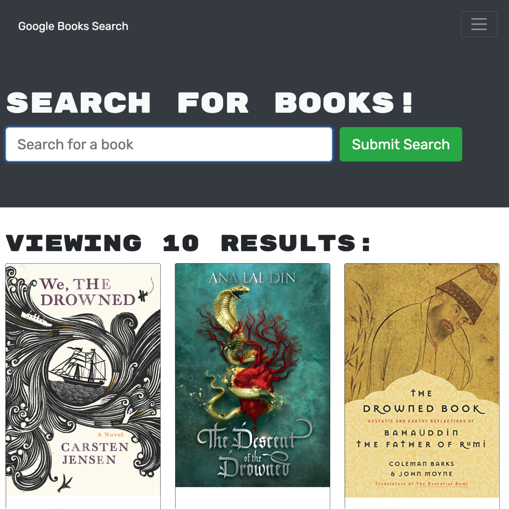

# Google Books Search Engine

[Deployed URL](https://enigmatic-inlet-56405.herokuapp.com/)
[Github Repository](https://github.com/eliselabonte/book-search-engine)

## Contents

* [Description](#Description)
* [Usage](#Usage)

## Description
This is a simple engine that uses the Google Books API to deliver search information.
The app was built using the MERN stack with a React front end, MongoDB database, and Node.js/Express.js server and API. Users can save book searches to the back end. 

## Usage
Search for books by author, title, or series by using the search bar at the top of the page. 